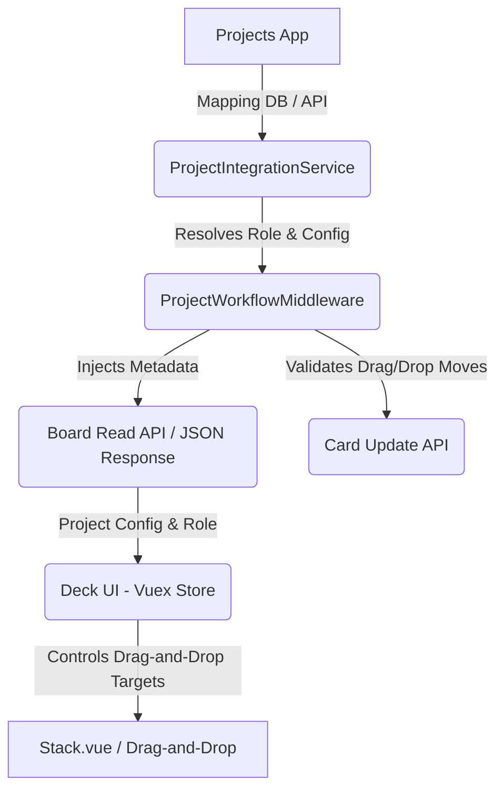

# Technical Architecture Plan: Modular Role-Based Workflows in Nextcloud Deck

This document serves as a reference for implementing modular, project-role-based card workflow constraints in the Nextcloud Deck app (forked for Nextcloud 34) while keeping core file changes minimal.

---

## 1. Core Integration Mechanics



### Key Integration Points
* **Projects/Organizations Apps:** Keep project definitions, board-to-project mappings, and user roles inside these apps.
* **Deck Custom Layer (`OCA\Deck\Custom\*`):** A dedicated folder where we write all our PHP classes (Services, Middleware, Configurations). This folder is not in the upstream repository, meaning updates will never overwrite it.
* **Minimal Core Diff:** We only inject 2-3 lines of hook code into core Deck controller registration and Vue files.

---

## 2. Backend Architecture (PHP)

### A. Custom Directory Namespace
Create all custom PHP backend logic in `lib/Custom/`:
* `lib/Custom/Service/ProjectIntegrationService.php` — Queries mapping tables in the Projects app.
* `lib/Custom/Workflow/WorkflowRegistry.php` — Contains static configurations for card movement constraints based on project type.
* `lib/Custom/Middleware/ProjectWorkflowMiddleware.php` — Middleware for request intercepting and JSON payload enhancement.

### B. Custom Middleware Implementation
Register `ProjectWorkflowMiddleware` in [Application::register](file:///home/taha/nextcloud_34/apps/deck/lib/AppInfo/Application.php#L118):
1. **API Response Decoration (`afterController`):** When the frontend calls `/apps/deck/api/v1.0/boards/{id}`, the middleware intercepts the response, queries `ProjectIntegrationService` for the project details and current user role, and adds a `customProjectMetadata` object to the JSON payload.
2. **API Request Validation (`beforeController`):** When the frontend attempts to move a card (`CardController::reorder` or `CardController::update`), the middleware intercepts the call, evaluates whether the user is allowed to move the card to the target stack, and throws a `NoPermissionException` if forbidden.

---

## 3. Frontend Architecture (Vue/JS)

### A. Vuex Store Registration
To avoid modifying the main store files like [store/main.js](file:///home/taha/nextcloud_34/apps/deck/src/store/main.js), we register a dynamic Vuex module in a custom initialization script:
```javascript
// src/custom/workflowStore.js
export default {
    state: {
        activeDraggedCard: null,
        currentProjectMetadata: null, // role, transitions, stacks mapping
    },
    mutations: {
        setActiveDraggedCard(state, card) {
            state.activeDraggedCard = card;
        },
        setProjectMetadata(state, metadata) {
            state.currentProjectMetadata = metadata;
        }
    },
    getters: {
        canMoveCardToStack: (state) => (cardId, targetStackId) => {
            // Check roles and static transition config
            // ...
        }
    }
}
```

### B. UI Constraint Hooks
In [Stack.vue](file:///home/taha/nextcloud_34/apps/deck/src/components/board/Stack.vue):
1. Change `@should-accept-drop="canEdit"` to support dynamic constraints:
   ```diff
   - @should-accept-drop="canEdit"
   + :should-accept-drop="shouldAcceptDrop"
   ```
2. Add a helper method that checks both edit rights and the custom workflow state:
   ```javascript
   shouldAcceptDrop(sourceContainerOptions, payload) {
       if (!this.canEdit) return false;
       return this.$store.getters.canMoveCardToStack(payload.id, this.stack.id);
   }
   ```
3. Update dragging events inside [Stack.vue](file:///home/taha/nextcloud_34/apps/deck/src/components/board/Stack.vue#L112-L113) to track the card in the store:
   ```diff
   - @drag-start="draggingCard = true"
   - @drag-end="draggingCard = false"
   + @drag-start="onDragStart(stack.id, $event)"
   + @drag-end="onDragEnd"
   ```

---

## 4. UI Visual Styling
To style unauthorized columns visually (such as dimming them or drawing a border) when a user drags a card:
* Each [Stack.vue](file:///home/taha/nextcloud_34/apps/deck/src/components/board/Stack.vue) component computes a dynamic class based on the store's `activeDraggedCard`:
  ```javascript
  computed: {
      stackDropStatusClass() {
          const draggedCard = this.$store.state.customWorkflow.activeDraggedCard;
          if (!draggedCard) return '';
          const isAllowed = this.$store.getters.canMoveCardToStack(draggedCard.id, this.stack.id);
          return isAllowed ? 'drop-allowed' : 'drop-forbidden';
      }
  }
  ```
* CSS classes style `.drop-forbidden` stacks with:
  ```css
  .stack.drop-forbidden {
      opacity: 0.4;
      pointer-events: none; /* snaps back on drag-drop */
      border: 1px dashed var(--color-text-maxcontrast);
  }
  ```

---

## 5. Development and Merge Strategy

| Action | Target | Merge Collision Risk |
|---|---|---|
| Register Middleware | [Application.php](file:///home/taha/nextcloud_34/apps/deck/lib/AppInfo/Application.php) | Low (Single line insertion) |
| Bind Drop Constraint | [Stack.vue](file:///home/taha/nextcloud_34/apps/deck/src/components/board/Stack.vue) | Low (Minor attribute change) |
| Core logic additions | `lib/Custom/` & `src/custom/` | **None** (New un-tracked directories) |
